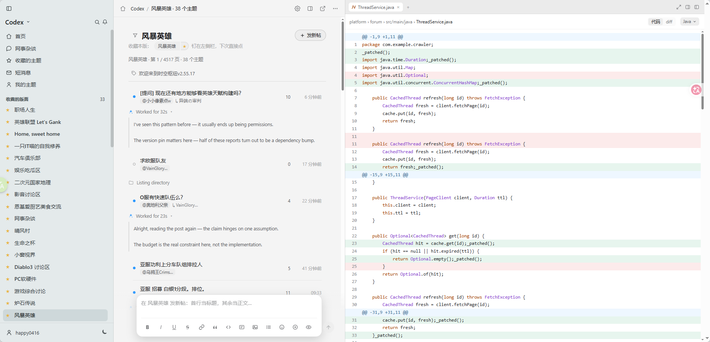
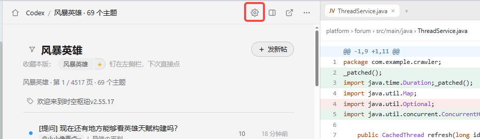
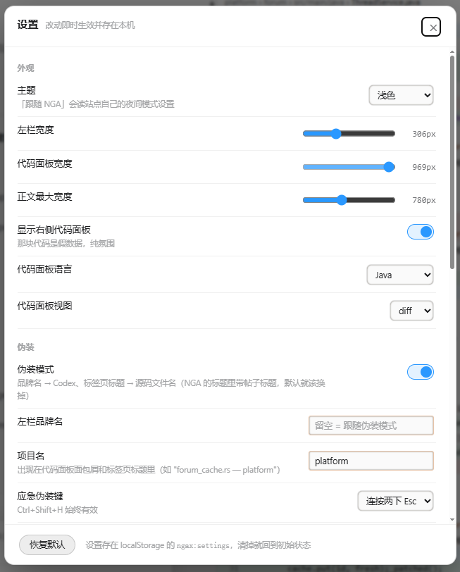

# NGA · Codex 外观（油猴脚本）

把 NGA 换成 **Codex 桌面 app** 的样子：左侧 rail + 中间会话流 + 右侧代码面板，明暗双主题，
并且带上真正能用的**上班摸鱼伪装**。

只改外观。原生 DOM、站点自己的 JS、原生回复/支持/反对/收藏逻辑全部保留 —— 脚本是
在这些之上**重新渲染一份视图**，不是替换站点。

移植自 [Linux DO · Codex 外观](https://github.com/czm15053/linuxdo-idea-ui)，作者 [@czm15053](https://github.com/czm15053)。外观设计系统和「假 agent 会话」
的装饰思路复用，所有跟站点数据结构相关的部分按 NGA 重写。

## 安装

1. 安装 [Tampermonkey](https://www.tampermonkey.net/)。
2. 打开 [nga-codex.user.js](https://github.com/George11811/nga-codex/blob/master/nga-codex.user.js)，点 Raw 后安装。
3. 访问 [bbs.nga.cn](https://bbs.nga.cn/) —— 需要**已登录**（NGA 对游客直接返回 403，脚本会识别出来
   并保留原生页面，不会瞎接管）。

## 预览



## 摸鱼相关

| 功能 | 默认值 |
| --- | --- |
| 标签页标题 | `<源码文件名> — <项目名>`（默认 `forum_cache.rs — platform`） |
| favicon | Codex 风格圆角图标 |
| 左栏品牌名 | `Codex` |
| 应急伪装键 | **连按两下 Esc**（`Ctrl+Shift+H` 始终有效） |
| 侧边栏模式 | 关（开了之后鼠标一离开页面区域就自动伪装，见下） |
| 页面透明度 | 100%（只调淡左栏 + 主区） |

应急键按下后整个视口变成「代码编辑器 + 正在跑 cargo test 的终端」，再按一次恢复。
设置面板：`Ctrl+,`。

### 页面透明度 / 侧边栏模式

- **页面透明度**（滑杆 20~100%，默认 100）：把脚本自绘的**左栏 + 主区**整体调淡
  （`--ngax-opacity` → 0.2~1）。设置面板、灯箱、悬停大图、应急伪装视图**不跟着变淡** ——
  前几个正在被操作，伪装视图必须看起来像另一个 app。浏览器页面透不出桌面，
  所以实际观感是「正文、卡片、底栏一起朝背景色退」，等于压低一档对比度。
- **侧边栏模式**（开关，默认关）：实时盯着鼠标，指针一离开页面区域
  （`mouseout` 且 `relatedTarget === null`）就切到**和连按两下 Esc 完全同一个**伪装视图。
  鼠标回到页面时是否还原由「回来自动还原」开关决定（默认开）。
  细节上的取舍：只自动还原**自动触发**的那次 —— 自己按应急键进出的伪装不受鼠标影响
  （手动按过键就清掉自动标记，回来不会再替你切换）；设置面板开着时不触发，
  免得调滑杆时鼠标扫出窗口把面板盖住。用 `mouseout` 而不是 `window.blur`：
  点地址栏、开 devtools 都会 blur，但鼠标还在页面上，那不叫离开页面区域。

## 设置面板



存在 `localStorage` 的 `ngax:settings`（和 V2EX 版的 `v2cx:settings` 不冲突，可以同时装）。
共 6 组、26 项：外观 / 伪装 / agent 装饰 / 引用 / 楼层 / 正文图片。
「恢复默认」在面板左下角。

## 关于引用的两点说明

- **引用**按 NGA 自己的格式生成（照抄 `commonui.quoteTo.procText()` 的产物）：
  `[quote][pid=…]Reply[/pid] [b]Post by [uid=…]名字[/uid] (时间):[/b] … [/quote]`，
  引用楼主时用 `[tid=…]Topic[/tid]`。粘出去和原生一模一样。
- **支持 / 反对 / 收藏**直接调原生 `commonui.postScoreAdd` / `commonui.favor`，不自己发请求。
  好处是校验位、权限位、每日额度、登录判定、报错文案全由站点负责；代价是这几个函数
  改签名就会失效（那时会弹提示让你走原生页面，不会假装成功）。

## 仓库结构

```
nga-codex.user.js        ← 成品：自包含单文件油猴脚本（装这个）
reference/               ← 参考的 V2EX 版（只读，不要改）
.build/                  ← 构建 + 测试
  p1.js p2.js p3.js      ← 脚本的三个片段（设置/常量/解析 · 渲染/视图 · 编辑器/伪装/编排）
  build.py               ← 拼装：把片段 + 移植的 CSS + 官方表情表合成成品
  smiles.js              ← 从 NGA 的 js_bbscode_core.js 抽出来的表情表
  test-bbcode.js         ← BBSCode 渲染器单测
  test-dom.js            ← jsdom 集成测试（用真实抓下来的页面）
  crawl-forums.py        ← 拼版面表（BFS + __UFICON 种子 + --search 关键词搜帖）
  extract-fids.js        ← 从 combine.js 抽 __UFICON 里的 fid 当种子
  restore-forums.py      ← 万一把 forums.json 覆盖了，从成品脚本里把版面表捞回来
  index-boards.json      ← 首页那份 CDN 版面目录（373 个，带分类/简介）
  forums.js / .json      ← 版面表（973 个，名字全部来自站点自己）
  render-preview.js      ← 把 jsdom 的渲染结果落成 HTML（配合 shot.sh 截图）
  shot.sh                ← 无头浏览器截图
  fids.txt               ← 早期手工校对版面名的记录（已被 crawl-forums.py 取代）
```

**为什么是生成的而不是一个手写大文件**：视觉设计系统（约 1900 行 CSS）是从 V2EX 版搬的，
机械改名（`v2cx-` → `ngax-`）比复制粘贴可靠；表情表是 NGA 的官方数据，同样不该手抄。
改需求请改 `.build/p*.js` 再跑构建，**不要直接改 `nga-codex.user.js`**（会被覆盖）。

```bash
python .build/build.py                    # 重新生成 nga-codex.user.js
python .build/crawl-forums.py --resume    # 需要更新版面表时（礼貌爬，间隔 1.1s）
```

构建会做几项静态检查：CSS 里不能出现反引号或 `${`（会截断 `String.raw` 模板）、
不能有重名函数（函数声明重名会静默覆盖，曾经把首页搞白屏过）。

## 测试

```bash
node .build/test-bbcode.js              # BBSCode 渲染器：真实帖子正文 + 22 项定点断言

mkdir -p /tmp/jt && cd /tmp/jt && npm install --no-save jsdom   # 集成测试需要 jsdom
JSDOM_DIR=/tmp/jt node <repo>/.build/test-dom.js                # 202 项集成断言
```

集成测试把**真实抓下来的 NGA 页面**灌进 jsdom（DOM 是真的、id/class/嵌套结构是真的），
再把 NGA 原生 JS 的产物（`userInfo.setAll` 的 JSON、`postArg.proc` 的参数、
`topicArg.add` 的参数、`__ALL_FORUM_DATA` / `__PAGE` / `__CURRENT_*`）用正则从页面里
抠出来喂给 window —— 这就是脚本在真实浏览器里会看到的世界。然后注入脚本、断言渲染结果
和交互（引用 / 支持 / 反对 / 收藏 / 发送 / 设置面板 / 伪装键）。

样本文件需要在系统临时目录里：`big.u.html`（多页主题）、`fid7.utf8.html`（版面列表）、
`th.utf8.html`（含附件的主题）、`home2.u.html`（首页）、`wow.u.html`（附件带尺寸变体）、
`ucp.u.html`（用户信息页）。

### 视觉验证（可选，但环境相关的坑比较多）

jsdom 没有排版引擎，断言只能验「结构对不对」，验不了「看起来对不对」—— 而换皮肤的脚本
「看起来对不对」才是重点。上面那两个 CSS 优先级 / 图片重复的 bug 就是靠截图发现的。

```bash
node .build/render-preview.js wow.u.html preview-wow.html   # 把 jsdom 的渲染结果落成 HTML
.build/shot.sh preview-wow.html shot.png 1500,1900          # 无头浏览器截图
```

`render-preview.js` 会顺手把 NGA 自带的 `<meta charset=GBK>` 覆盖成 UTF-8
（不覆盖的话截出来全是乱码）、并注入 `<base>` 让相对链接能解析。
`shot.sh` 每次先清掉**只属于自己 profile** 的残留无头进程再跑，并用独立
`--user-data-dir`（否则 Edge/Chrome 会把命令行「转交」给已在运行的实例，
静默退出、什么都不做）。

> 在本地环境里这套截图链路被安全软件拦了（前两次成功，之后启动无头浏览器
> 静默返回 0 且不生成文件）。所以它只能当「方便时用一下」的工具，不要当 CI 依赖。
> 拿不到截图时的替代方案是 `getComputedStyle` 断言 —— 见下。

### 用 getComputedStyle 押 CSS 优先级

`testContentImageCss()` 直接问 `getComputedStyle`「最后算出来什么」。jsdom 的级联实现
会算优先级，所以能真的押住「写了但被别处盖掉」这类错 —— 而这类错**看代码是看不出来的**：

```
✓ 脚本渲染的表情：行内而非块级（inline-block）
✓ 站点原生表情（class=smile_ac）同样当行内小图
✓ 普通内容图：仍是块级大图
```

## 一些实现上的坑（都已处理，记下来免得再踩）

1. **作者名是 JS 填的**：`<a id='postauthor0'></a>` 在源码里是空的，作者名来自
   `commonui.userInfo.users[uid].username`（同一页内联的 `setAll(JSON)`）。所以脚本读的是
   原生 JS 处理**之后**的 DOM，并且优先用 `commonui` 里的数据而不是 DOM 文本。
2. **附件是异步渲染的**：正文里可能还是字面量 `[img]./mon_202609/…[/img]`。脚本自带
   BBSCode 渲染器兜底，另外还会去读行内脚本里的附件元数据；两条路都按**文件名**去重，
   免得同一张图渲染两遍。原生内容后续变化由一个 MutationObserver 兜住
   （重算「页面签名」，签名变了才重渲染，并保住滚动位置）。
3. **「跟随站点」不能量 body**：接管之后 body 背景已被自己的 `!important` 覆盖，量它
   等于量自己。所以读 NGA 自己的主题色 `window.__COLOR`（`js_color3.js` 的产物）。
4. **不能用「移出视口」的方式藏原生 DOM**：NGA 的「跳到指定楼层」会 `scrollIntoView`，
   视口会被拖到 `-99999px` 去。用 `display:none`（没有盒子 → `scrollIntoView` 是空操作）。
   隐藏是安全的，因为决定楼层显示粒度的 `postDispCalcContentLength` 只数文本节点字符数、
   不做几何测量。
5. **NGA 的 `reply to` 头部是 `[pid=pid,tid,楼层]`**，逗号分段，不是纯数字；正则少写两段
   就会漏。另外捕获组顺序错位会让 uid 拿到名字、name 拿到时间 —— 这类错误只有在
   逐字段断言时才会暴露。
6. **`document-start` 阶段不能做任何 DOM 探测**。`@run-at document-start` 时 `<body>` 还
   没被解析，`document.getElementById("mmc")` 必然是 `null`。当初就是用带这个探测的
   `isSupported()` 去决定「首帧要不要先藏原生页面」的，结果那行代码从来没生效过 ——
   表现就是切版面 / 点进帖子时闪一帧完整的原生页面（米色底 + NGA 顶栏 + 分页）。
   现在拆成两个函数：`lockableRoute(r)` 只看 URL（首帧用这个）、`isSupported(r)`
   再看 DOM（渲染时用）。隐藏规则也从「枚举容器」改成直接藏 `#mmc` ——
   枚举只要漏一类就会又把整页漏出来。
7. **站点主题色是解析到一半才到的**：NGA 的主题色来自 `js_color3.js`（或 `js_color.js` /
   `1` / `2`，由 cookie 决定用哪个）。所以首帧只能按深色猜，等 `window.__COLOR`
   出现后要自己纠正 —— 否则亮色主题的用户会看到「深色底闪一下再变亮」。
8. **CSS 优先级：表情被当成内容大图。** 约束内容图的 `.ngax-cooked img` 是 (0,1,1)，
   而光秃秃的 `.ngax-smile` 只有 (0,1,0) —— 比不过它，于是表情继承了
   `display:block` + `max-width:260px`，一个占一行、每个一百多像素高。
   用户看到的现象就是「莫名其妙的空白很多」。修法是写成 (0,2,1) 压下去，
   并且**两套 class 都要盖**：脚本自己渲染的是 `ngax-smile`，而真实浏览器里
   正文是站点渲染的，表情 class 是 `smile_ac` / `smile_a2`…
   同类问题还有一处：灯箱/悬浮预览原来只认 `ngax-smile`，所以真实环境里
   点一下表情会弹灯箱。凡是「按 class 认元素」的地方都得考虑站点自己的形态。
9. **同一张附件有多个 URL 形态**：实测同一楼里正文是
   `mon_…-sg.jpg.medium.jpg`（中等尺寸变体），附件元数据里是 `mon_…-sg.jpg`（原图）。
   按文件名去重会把它们当两张图 → 同一张图渲染两遍。要先把尺寸变体后缀
   （`.medium` / `.thumb` / `.tmp` …）剥掉再比。原生之所以只显示一遍，
   是因为 `ubbcode.attach.load(spanId, contentId, …)` 特意收了正文元素 id
   用来跳过已在正文里的附件 —— 脚本的去重就是在模拟这个行为。
10. **「内容客户端渲染、数据内联在页面里」是个很常见的搭配**，用户信息页就是这样：
   `#ucp_block` 在服务端 HTML 里是空的（内容由 `js_ucp.js` 现建），
   但完整数据以 `__UCPUSER = {…}` 内联在同一页里。所以脚本**读数据而不是读渲染结果**
   （字段更全、也不会因为站点改排版而挂）。代价是那排动作按钮只有原生 DOM 里才有，
   得等 `js_ucp.js` 建完 —— 靠 MutationObserver 补，并用「页面签名带上按钮数量」
   保证签名真的会变。同类：首页的 `indexBlock.add(...)`、帖子页的 `userInfo.setAll(...)`。
11. **别把站点已经排好版的内容当原始数据用**：状态（buffs）那项的 HTML 是站点渲染好的，
   里面已经写了「持续至 2027-04-09」，再补一个自己的到期时间就是同一件事显示两遍。
   凡是「转存站点渲染结果」的地方都得先看一眼它里面是不是已经包含这个信息了。
## 版面大全的分类

首页的版面大全不是一坨按拼音排的平铺，而是按**站点自己的分类目录**分组：

```
网事杂谈 (46)     → 无名组 / IT软硬件 / 数码综合
暴雪游戏 (11)
魔兽世界 (36)     → 无名组 / 职业讨论区 / 冒险心得 / 历史研究 讨论区
拳头游戏 (5)  Valve Games (5)
游戏专版 (519)    → 四个无名组（站点数据里这组就没名字）
社区事务 (37)
其它版面 (674)    ← 目录里没有的（爬表是超集）
```

数据来自首页那份 CDN 文件 `proxy/cache_attach/bbs_index_data.js`（`extract-cats.py` 抽取），
顺序也是站点自己的顺序，还带每个版面的**简介**（鼠标悬停可见）。

⚠ 一个卡片不等于一个版面：659 条里只有 373 条是真版面，其余 286 条是**合集**
（`{fid: 428, name: '赛事/活动', stid: 29182350}` —— `fid` 只是宿主版面，真实身份是 `stid`，
链接是 `?stid=`）。第一版抽取器只看 `fid`，结果「手机 网页游戏综合讨论」底下的 187 个合集
全被算成了同一个版面。合集只渲染、不给星标（既有的收藏逻辑按版面走，合集那条 key 没做）。
19. **「渲染两次」是重入，不是渲染逻辑写错。** 现象：左下角用户栏出现两行，
   而且只有**部分页面**会。原因：`renderRail` 里会读 NGA 的版面历史，而读的时候如果
   `hisLink` **已经 init 好了**，`commonui.waitForumViewHis` 会**同步**回调 →
   回调里又调 `renderRail`，外层那趟还没跑完，于是 foot / 用户栏 / 明暗按钮 / 拖拽把手
   被追加了两遍（滚动容器只保留新的那个，所以只有那几样翻倍）。
   同步还是异步取决于 `hisLink` 有没有 init：版面页的页面脚本会调 `ForumViewHis()`
   记录访问 → 提前 init → 走同步路径 → 出问题；帖子页不记录 → init 没完成 → 回调异步 →
   没问题。这就是「帖子详情里没问题」的原因。
   修法不是在那一处加 `setTimeout`，而是在 `renderRail` 入口挡重入：
   渲染中再触发的渲染会被合并成「跑完后再来一趟」。另外 `ensureRail` 也会砍掉多余的
   rail 元素（`querySelector` 只拿第一个，留着第二个就永远修不干净）。

## 已知限制

- `nuke.php` 里**只接管用户信息页**（`func=ucp&uid=N`）；收藏夹 / 短消息 / 通知等其它
  nuke.php 页面，以及 `post.php`（发帖页）**不接管**：保留原生页面，只把内容右移给 rail 让位。
  认不出数据时也会回退原生页（比如 `func=ucp` 的其它子页面）。
- 未登录时不接管任何内容页（NGA 返回 403 的「游客不能直接访问」）。
- 依赖 `window.commonui` 的内部结构（`postArg.data` / `userInfo.users` / `postScoreAdd` /
  `favor`）和 `#topicrows` / `#postcontentN` 这类 id。NGA 改版可能让某些功能退化 ——
  脚本里每处都有兜底，取不到就退回解析 DOM 或老实提示，不会白屏。


## 授权与致谢

本仓库的代码以 **MIT** 发布（见 `LICENSE`）。

**参考自 [Linux DO · Codex 外观](https://github.com/czm15053/linuxdo-idea-ui)，作者 czm15053。**
配色 token（实测自 Codex 桌面 app）、三栏布局、右侧代码面板、底部输入框、
agent 思考块、hover 操作胶囊、明暗双模式这些设计都是那个脚本的成果。
